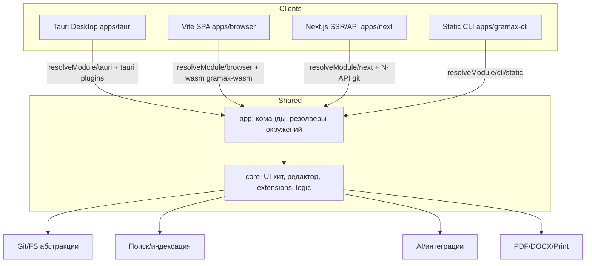
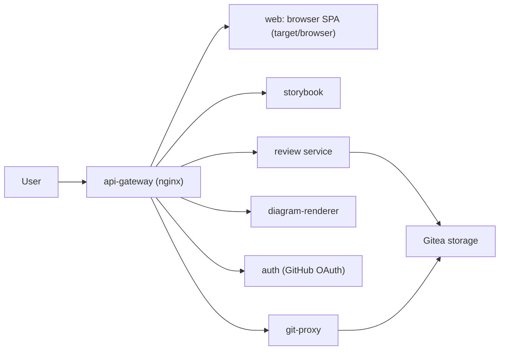

# Gramax -- обзор репозитория и архитектуры

## Назначение продукта

Gramax -- редактор и портал «docs as code» с локальным хранением Markdown, визуальным WYSIWYG‑редактором, поддержкой Git, публикацией каталога в виде сайта и десктопной/веб/CLI‑версий.

## Монорепо и ключевые пакеты

-  `core/` -- общий UI‑кит, расширения (Markdown, Git, импорт Confluence/Notion, PDF/Word экспорт, AI, Enterprise), бизнес‑логика (файловая модель, роутинг, API), стили.

-  `app/` -- команды приложения и резолверы под разные окружения (`resolveModule/…`: browser/tauri/next/cli/static/wasm, вызовы git/fs/search, PDF/Word, AI).

-  `apps/browser/` -- Vite SPA для браузера (использует wasm‑мост к Rust git/fs).

-  `apps/tauri/` -- десктоп на Tauri 2.0, Rust плагины `plugin-gramax-fs` и `plugin-gramax-git` для нативного доступа к диску и Git.

-  `apps/next/` -- SSR/SPA портал и API‑слой на Next.js, Rust N-API модуль `next-gramax-git` для Git‑операций.

-  `apps/gramax-cli/` -- CLI/SSG для сборки статического сайта, конверты, импорты.

-  `storybook/` -- каталог UI компонентов.

-  `e2e/` -- Cucumber-фичи и шаги для end‑to‑end тестов.

-  `crates/` и `apps/*/crates/` -- Rust библиотеки (git/fs обёртки, wasm, инструменты).

## Основные библиотеки и стэк

-  UI: React 18, MUI 7, Emotion, Zustand, SWR, @tanstack/react-virtual, react-dnd/@dnd-kit, @monaco-editor/react, lucide-react.

-  Редактор/Markdown: TipTap + ProseMirror, highlight.js/lowlight, markdown-it (+katex), mermaid, plantuml-encoder, Excalidraw/diagram utils.

-  Поиск/интеграции: fuse.js, lunr, Typesense/Algolia клиенты, @ics/gx-\* (AI/поиск/векторка), kafkajs (инфра), typesense/algolia adapters.

-  Экспорт/импорт: pdfmake, pdfjs, docx/docx-preview/mammoth, mathjax, html-to-image, jszip.

-  Инфраструктура: Vite 6, Bun lockfile, Jest + Testing Library, ts-jest, MSW; E2E -- Cucumber + Playwright‑стек в `e2e/runner`.

-  Rust/Tauri: `tauri` 2\.x, плагины deep-link/dialog/shell/updater, serde/reqwest/tracing.

## Высокоуровневая архитектура

## Раскладка модулей

-  **Редактор**: `core/extensions/markdown` + TipTap плагины, блоки (таблицы, диаграммы, сниппеты, медиа, Swagger, опросы), предпросмотр и рендер.

-  **Файловая модель**: `core/logic/FileProvider`, `app/commands/article|catalog|workspace|storage` -- чтение/запись статей, навигация, права доступа, синхронизация.

-  **Git**: `core/extensions/git`, `app/commands/versionControl`, Rust плагины/wasm (`apps/tauri/plugins`, `apps/browser/crates/gramax-wasm`, `apps/next/crates/next-gramax-git`).

-  **Импорт/Миграция**: `core/extensions/confluence`, `core/extensions/notion`, `app/commands/storage/import`.

-  **Поиск и AI**: `core/extensions/serach`, `extensions/ai`, @ics/gx-\* для векторки и Elastic/Typesense; чат/индексация командой `app/commands/search`.

-  **Экспорт/публикация**: `core/extensions/pdfExport`, `core/extensions/wordExport`, CLI статический билд (`apps/gramax-cli/src/features/import`/`cli/build`), Next API `/api/html` и sitemap.

-  **Enterprise**: `core/extensions/enterprise`, `app/commands/enterprise` (рабочие пространства, роли, квизы, инбокс).

-  **Тесты**: unit/Jest в `core`/`app`, e2e Cucumber фичи в `e2e/features/*`, storybook визуальные снапшоты.

## Развёртывание (docker-compose)

Сети/лимиты заданы общими якорями `x-common-*`, используется `gitea` как Git‑хранилище, отдельные сервисы для рендеринга диаграмм и ревью.

## Сборка и конфигурация

-  Vite конфиг (`vite.config.ts`) внедряет критические стили/скрипты в HTML, использует node polyfills и загрузку sourcemaps в Bugsnag.

-  `app/config/*.ts` и `scripts/compileTimeEnv.mjs` управляют окружением (`VITE_ENVIRONMENT`, `PRODUCTION`, переменные для desktop/browser/next/cli).

-  Workspaces управляются `package.json` + `tsconfig.json`, Rust workspace -- `Cargo.toml`.

## Где смотреть дальше

-  Бизнес‑команды: `app/commands/**`

-  UI и редактор: `core/components/**`, `core/extensions/markdown/**`

-  Плагины Tauri: `apps/tauri/plugins/**`

-  WASM git/fs: `apps/browser/crates/gramax-wasm/**`

-  Next API/страницы: `apps/next/pages/**`

-  CLI: `apps/gramax-cli/src/**`

-  E2E сценарии: `e2e/features/**`