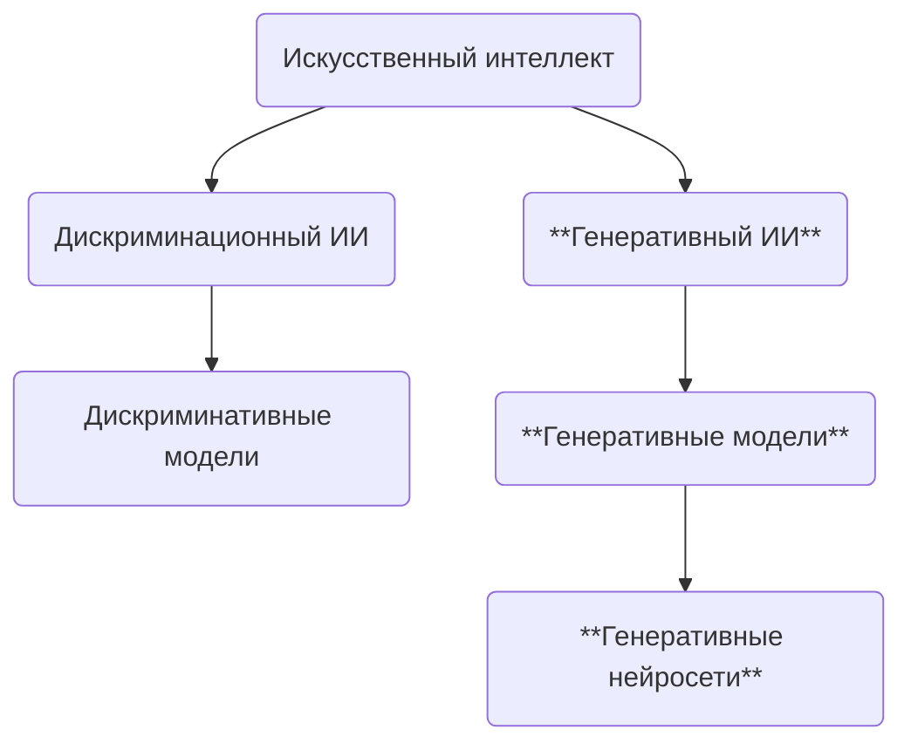
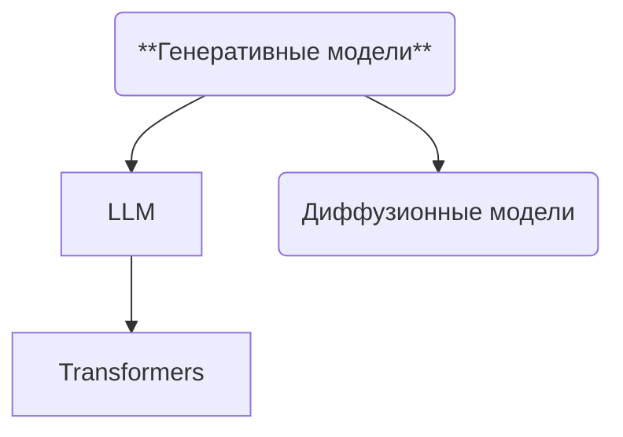

# Gramax -- обзор репозитория и архитектуры

## Назначение продукта

Gramax -- редактор и портал «docs as code» с локальным хранением Markdown, визуальным WYSIWYG‑редактором, поддержкой Git, публикацией каталога в виде сайта и десктопной/веб/CLI‑версий. jjjj

\#AI Определения для искусственного интеллекта не существует. Можно дать такое определение: **Искусственный интеллект** - это система которая может решать интеллектуальные задачи. Интеллектуальные задачи это те задачи с которыми сталкивает человек в повседневности: от приготовления ужина до придумывания алгоритмов и решения математических задач Кроме того, AI должен обладать еще 3 способностями:

-  Способностью обучаться

-  Способностью мыслить

-  Способностью планировать

Один из видов AI, на базе которого сейчас создается множество продуктов это генеративный ИИ

**Генеративный ИИ** (Generative Artificial Intelligence, GenAI или GAI) -- ИИ, способный генерировать (создавать) текст, изображения, видео и другие данные с помощью генеративных моделей. <https://blog.skillfactory.ru/glossary/generativnyy-iskusstvennyy-intellekt/>

**Генеративная модель** (generative model) -- это обобщенный термин, который охватывает различные методы и алгоритмы машинного обучения, используемые для создания новых данных, основанных на обучающем наборе данных. Эти модели могут создавать тексты, изображения, звуки или другие типы данных, которые воспроизводят стили, паттерны и характеристики исходного набора данных.

**Генеративная нейросеть** (generative neural network) -- конкретный тип генеративной модели, которая использует нейронные сети для создания новых данных. Наиболее известным примером является генеративная состязательная сеть (Generative Adversarial Network или GAN), которая состоит из двух нейросетей: генератора и дискриминатора. Генератор создает новые данные, а дискриминатор оценивает их, что позволяет генератору улучшать свои результаты через итеративный процесс обучения.

!\[\[generative_vs_discriminative_models_593f8fe604_cc2dc8db48.webp\]\] Дискриминативные модели **предназначены для анализа и предсказания на основе существующих данных, выявляя зависимости между различными факторами**. В сфере недвижимости они эффективны для задач, связанных с анализом состояния объектов, прогнозированием доходности и управлением эксплуатацией, кредитном скорринге. В общем, основное различие заключается в том, что дискриминативные модели сосредоточены на различении классов, тогда как генеративные модели пытаются понять, как эти классы образуются, и имеют возможность генерировать новые примеры.

\[\[LLM\]\]

Диффузионные модели (diffusion models) -- тип генеративных моделей, которые используются для создания изображений из случайного шума. Яркие представители: Midjourney, DALL-E, Stable Diffusion.

\[\[Промпт\]\] \[\[Токен\]\] \[\[Контекст\]\]

### Классификация моделей

TTS / STT / TTI / ITT и т.д. -- классификация моделей по типу входных и выходных данных. Например, STT расшифровывается как speech-to-text и обозначает, что модель принимает на вход речь, а на выходе выдает текст. Пример такой модели -- Whisper от OpenAI, которая служит для транскрибации речи в текст. Примеры других аббревиатур: TTS (text-to-speech), TTI (text-to-image), ITT (image-to-text), TT3D (text-to-3D), TTV (text-to-video) и т.д.

Мультимодальность (multimodality) -- cпособность моделей обрабатывать и анализировать данные в разных форматах (модальностях): текст и графика и аудио и видео и т.д. Эта способность стремится приблизить восприятие мира моделей к человеческому, позволяя им интегрировать и интерпретировать данные из разных модальностей одновременно. Яркие примеры существующих мультимодальных моделей -- GPT-4o и Gemini.

\[\[Обучение моделей\]\]

### Context window

#### Ограничение LLM

Трансформер Это модель предобученная воспринимать фрагмент текста и выдавать предсказание того, что будет дальше в этом отрывке. Такое предсказание текста имеет форму распределения вероятностей для различных вариантов следующего слова

### Как работает LLM?

1. Токенизация - входные данные (\[\[Промпт\]\]) разбиваются на \[\[Токен|токены\]\]. Инструменты которые выполняют эту задачу называются tokenizer

2. Эмбеддинг (embedding) -- метод преобразования токенов в векторы. Комбинация этих чисел (читай вектор), помогает находить сходства между преобразованными объектами. Эмбеддингом еще назвается токены представленные в виде числовых векторов

3. Далее каждый из токенов ассоциируется с вектором который должен каким-то образом закодировать значение этого фрагмента!\[\[Screenshot 2025-06-02 at 17.57.55.png\]\] Слова с похожими значениями имеют векторы близко друг к другу в этом пространстве

4. Затем векторы проходят через операцию Attention block, которая позволяет векторам общаться друг с другом и передовать информацию туда сюда. Attention block позволяет понять какие слова в контексте имеют отношение друг к другу и как нужно обновить векторы на основе этих слов

5. Далее эти векторы проходят через операцию "Многослойный перцептрон" (Feed forward layer). На этом уровне по каждому вектору задаются вопросы и исходя из ответов значение вектора пересчитывается

6. Процессы Attention block и Многослойный перцептрон многократно повторяются

Авторегрессия (autoregression) -- метод, который в контексте языковых моделей означает, что модель предсказывает следующее слово или токен на основе всех предыдущих слов в последовательности.

Температура (temperature) -- гиперпараметр, который позволяет управлять разнообразием и креативностью генерируемых выходных данных. Этот параметр влияет на распределение вероятностей, из которого выбираются следующие элементы (например, слова или буквы) в последовательности. Проще говоря, чем больше температура тем больше галлюцинирования и креатива. Всё как у людей. Температуру моделей редко дают изменять в web-интерфейсах типа ChatGPT, но она практически всегда доступна для изменения через API.

Квантизация (quantization, quantized model, q4, q8) -- одна из форм сжатия модели с потерями. По сути, это попытка найти баланс между сохранением как можно большего количества исходных данных и производительностью, отбрасывая информацию, которая не оказывает существенного влияния на результаты. По умолчанию большинство моделей хранят параметры в виде шестнадцатибитных чисел с плавающей запятой (fp16). Эта точность может быть уменьшена специальными методами до 8 и 4 бит. Это и есть q8 и q4. При сжатии модель теряет в качестве ответов, но кратно уменьшает потребляемые ресурсы. Как так? Для работы модели её нужно загрузить в память (видео либо оперативную, зависит от софта и железа, на котором она запускается). Предположим, мы имеем модель на 13B параметров в fp16. 16 бит на один параметр = 2 байта на параметр. Следовательно, на такую модель у нас уйдёт 13 000 000 000 x 2 байта, что равно 24,2 Гб памяти. Для среднестатистического ноутбука это многовато, поэтому умельцы переделывают модели в q8 и q4, соответственно модель занимает 12,1 Гб или 6,1 Гб памяти, что уже значительно приятнее, можно даже на телефоне пробовать запускать.